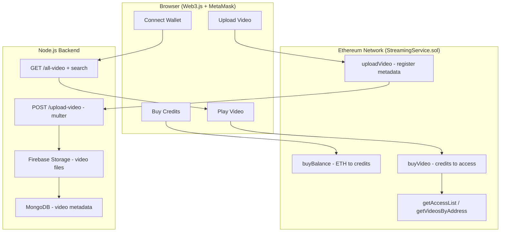

<div align="center">

# CryptoStream

### A Decentralised Video Streaming Service

Upload, discover, and monetize videos with **blockchain-enforced access control** — pay with test ETH, earn on-chain credits, and stream with MetaMask.

**Web3** · **Solidity** · **Express** · **MongoDB** · **Firebase Storage**

</div>

---

## Table of Contents

- [Overview](#overview)
- [How It Works](#how-it-works)
- [Features](#features)
- [Tech Stack](#tech-stack)
- [Project Structure](#project-structure)
- [Getting Started](#getting-started)
- [API Reference](#api-reference)
- [Smart Contract Reference](#smart-contract-reference)
- [Deployment](#deployment)
- [Roadmap](#roadmap)
- [Contributing](#contributing)
- [Disclaimer](#disclaimer)

---

## Overview

CryptoStream is a full-stack decentralized video platform that pairs a classic web architecture (Express + MongoDB + Firebase Storage) with a Solidity smart contract that acts as the **source of truth for access control and payments**.

Instead of platform-issued subscriptions, viewers purchase **on-chain credits** by sending test ETH to the contract. Each video costs a fixed amount of credits to unlock, and access is recorded permanently on the blockchain — no central server decides who can watch what.

## How It Works



**Upload flow:** the frontend first registers the video on-chain (`uploadVideo`), then sends the file to the backend, which stores it in Firebase Storage and saves its metadata (title, description, download URL) in MongoDB.

**Access flow:** clicking *Play* queries the contract's access list. If the wallet has access, the video streams from Firebase. Otherwise the user is prompted to spend 100 credits via `buyVideo`, which permanently grants access on-chain.

## Features

- **On-chain access control** — per-video access lists in the `LockUnlockVideos` mapping; `getVideo` is only callable by authorized addresses
- **Tokenized credit economy** — send >= 0.001 ETH to mint 1,000 credits per unit (1M credits per ETH); balances tracked in the `balances` mapping
- **Creator uploads** — metadata registered on-chain, files stored in Firebase Storage, searchable index in MongoDB
- **Live search** — case-insensitive title search via `GET /all-searched-video/:search`
- **MetaMask integration** — Web3.js + injected provider, no accounts or passwords
- **Transparent ledger** — every purchase emits `VideoPurchased`, every upload emits `VideoUploaded`
- **Responsive dark UI** — single-page app with Home / My Videos / Upload / Wallet views

## Tech Stack

| Layer        | Technology                                                    |
| ------------ | ------------------------------------------------------------- |
| Blockchain   | Solidity (>= 0.7.0), Web3.js, MetaMask                        |
| Backend      | Node.js, Express, Multer                                      |
| Storage      | Firebase Storage (files), MongoDB + Mongoose (metadata)       |
| Frontend     | Vanilla HTML/CSS/JS — single-page app                         |
| Deployment   | Vercel (`@vercel/node`) via `vercel.json`                     |

## Project Structure

```
├── public/            # Frontend (served statically by Express)
│   ├── index.html     # CryptoStream SPA - UI, Web3 logic, contract ABI
│   └── style.css      # Styles
├── server.js          # Express API - upload, list, search, Firebase + Multer
├── mongodb.js         # Mongoose connection + video schema
├── Video.sol          # StreamingService - credit economy & access control
├── Owner.sol          # Ownable base contract (authorization control)
├── vercel.json        # Vercel serverless configuration
├── package.json       # Dependencies & scripts
└── .env               # (local only, never commit) - see below
```

## Getting Started

### Prerequisites

- [Node.js](https://nodejs.org/) >= 18 (ESM modules)
- A [MongoDB](https://www.mongodb.com/atlas) database (local or Atlas)
- A [Firebase](https://console.firebase.google.com/) project with **Storage** enabled
- [MetaMask](https://metamask.io/) with a funded test-network account (e.g. Sepolia)
- [Remix](https://remix.ethereum.org/), Hardhat, or Truffle to deploy the contract

### Environment Variables

Create a `.env` file in the project root:

```bash
# MongoDB connection string
MONGO_SERVER=mongodb+srv://<user>:<password>@cluster.mongodb.net/cryptostream

# Firebase project config (Firebase console -> Project settings)
FIREBASE_API_KEY=your-api-key
FIREBASE_AUTH_DOMAIN=your-project.firebaseapp.com
FIREBASE_PROJECT_ID=your-project-id
FIREBASE_STORAGE_BUCKET=your-project.appspot.com
FIREBASE_MESSAGING_SENDER_ID=your-sender-id
FIREBASE_APP_ID=your-app-id
```

> **Note:** `server.js` reads Firebase config from these env vars — storage uploads will fail without them.

### Installation

```bash
# 1. Clone the repository
git clone https://github.com/TMystic/Decentralised-Streaming-Service.git
cd Decentralised-Streaming-Service

# 2. Install dependencies
npm install

# 3. Configure environment
cp .env.example .env   # then fill in your values

# 4. Start the server
npm start
```

The app will be available at `http://localhost:3000`.

### Smart Contract Deployment

1. Open `Video.sol` in [Remix](https://remix.ethereum.org/) (it imports `Owner.sol` — add both files).
2. Deploy `StreamingService` with the constructor argument `recipient` set to the address that should receive the ETH from credit purchases.
3. Copy the **deployed contract address** and ABI into the frontend:
   - `contractAddress` in `public/index.html` (currently `0xa25d735b938FE3d565F38f49e33e9e0f483bD30E`)
   - the `contractABI` constant (regenerate via Remix -> Compile -> ABI)

### Running Locally

1. Ensure the backend is running (`npm start`).
2. Open `http://localhost:3000` and click **Connect Wallet**.
3. In **Wallet**, enter >= 0.001 ETH and click **Buy Credits** — approve the transaction in MetaMask.
4. Upload a video via the **Upload** page (on-chain registration + file upload).
5. Play videos from **Home**; owned or purchased videos appear under **My Videos**.

## API Reference

All routes are served by the Express backend (`server.js`).

### `POST /upload-video`

Uploads a video file (`multipart/form-data`), stores it in Firebase Storage, and saves metadata to MongoDB.

| Field         | Type   | Required | Description       |
| ------------- | ------ | -------- | ----------------- |
| `videoFile`   | file   | yes      | Video file (mp4)  |
| `title`       | string | yes      | Video title       |
| `description` | string | yes      | Video description |

**Response:** `200 OK` — `{ "message": "Video uploaded successfully!" }`

### `GET /all-video`

Returns every video document from MongoDB.

**Response:** `200 OK` — array of `{ number, title, description, videoPath, uploadedAt, _id }`

### `GET /all-searched-video/:search`

Returns videos whose title matches the query (case-insensitive regex).

```bash
curl "http://localhost:3000/all-searched-video/tutorial"
```

**Response:** `200 OK` — filtered array of video documents.

## Smart Contract Reference

### `StreamingService` (`Video.sol`)

| Function                          | Type    | Cost         | Description                                                |
| --------------------------------- | ------- | ------------ | ---------------------------------------------------------- |
| `buyBalance()`                    | payable | >= 0.001 ETH | Mints 1,000 credits per 0.001 ETH sent; forwards ETH to `recipient` |
| `uploadVideo(title, description)` | public  | —            | Registers a video and grants the uploader access           |
| `buyVideo(videoNumber)`           | public  | 100 credits  | Grants the caller access to a video                        |
| `getVideo(_id)`                   | view    | —            | Returns video metadata — reverts if the caller has no access |
| `getAccessList(videoNumber)`      | view    | —            | Lists all addresses with access to a video                 |
| `getVideosByAddress(_addr)`       | view    | —            | Lists video IDs an address owns or has purchased           |

**Constants:** `COST = 0.001 ether` · `REWARD = 1000` credits per unit · purchase price `100` credits

**Events:** `VideoUploaded(id, title, description)` · `VideoPurchased(videoId, buyer, message)`

### `Ownable` (`Owner.sol`)

Standard OpenZeppelin-style ownership base: `owner()`, `isOwner()`, `onlyOwner` modifier, `transferOwnership()`, `renounceOwnership()`, and the `OwnershipTransferred` event.

## Deployment

The repo includes `vercel.json` for serverless deployment with the `@vercel/node` runtime:

```bash
npm i -g vercel
vercel
```

Configure the same environment variables in Vercel's dashboard (**Settings -> Environment Variables**) as your local `.env`.

## Roadmap

- [ ] Streaming / transcoding pipeline (HLS or DASH)
- [ ] Wallet-based auth on the backend (signed-message verification)
- [ ] Token (ERC-20) instead of internal credit mapping
- [ ] Creator payout splitting
- [ ] Tests (Hardhat + Supertest)
- [ ] Docker setup

## Contributing

Contributions are welcome! Feel free to open an issue or submit a pull request.

1. Fork the repository
2. Create a feature branch (`git checkout -b feature/amazing-feature`)
3. Commit your changes (`git commit -m 'Add amazing feature'`)
4. Push to the branch (`git push origin feature/amazing-feature`)
5. Open a Pull Request

## Disclaimer

This project was built for **educational / hackathon purposes**. It uses test-network ETH only, and the smart contracts have not been audited. Do not use in production without a professional security review.
